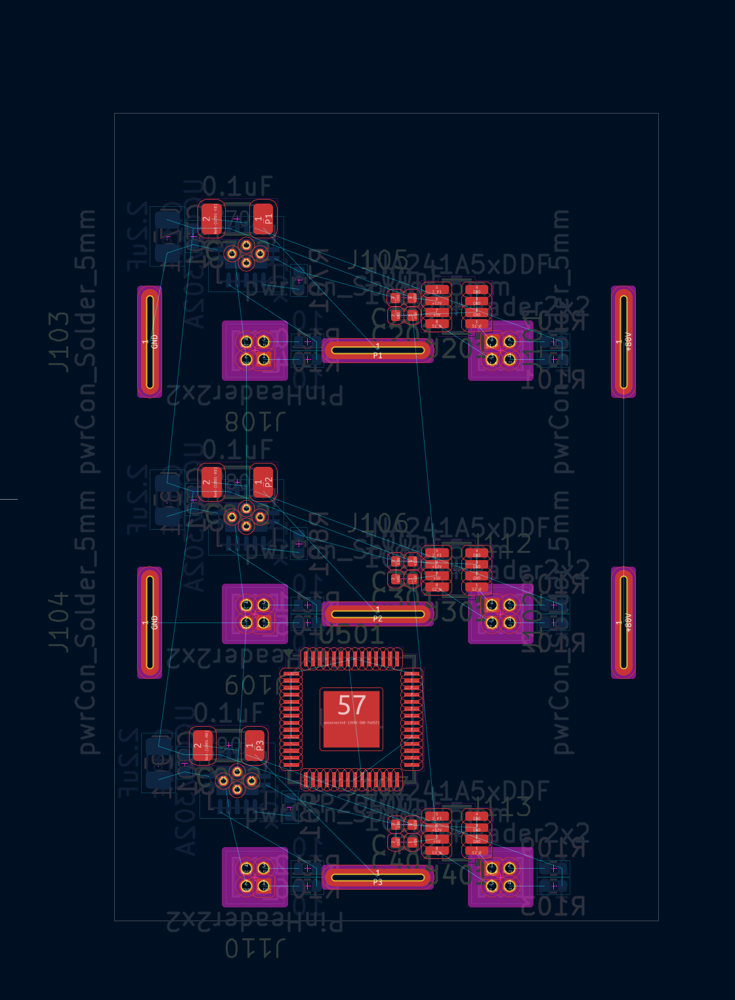

# drvr
/ˈdraɪvər/

### TL;DR
driver stage implementing solder pads for current tabs, shunt amplifiers, adc, parallel mosfet drivers, gate drive power supply, microcontroller for current and sensorless motor control

